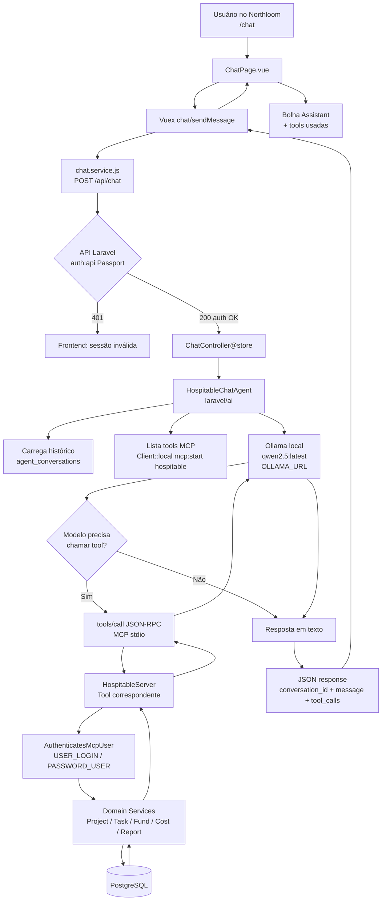
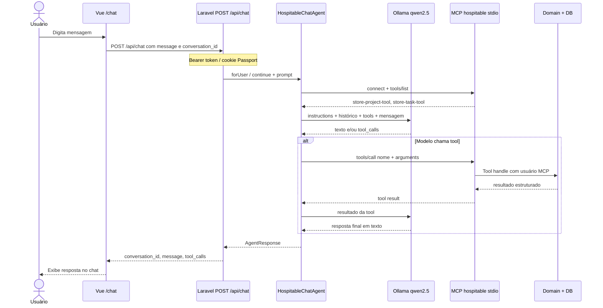

# Vue 3 + Vite

This template should help get you started developing with Vue 3 in Vite. The template uses Vue 3 `<script setup>` SFCs, check out the [script setup docs](https://v3.vuejs.org/api/sfc-script-setup.html#sfc-script-setup) to learn more.

Learn more about IDE Support for Vue in the [Vue Docs Scaling up Guide](https://vuejs.org/guide/scaling-up/tooling.html#ide-support).
# Fluxo do Chatbot — Frontend → Ollama (Qwen 2.5) → MCP Laravel

Documento de fluxo do assistente de planejamento (Northloom) até as ferramentas MCP do backend .

## Visão geral

O usuário digita no chat do Vue. A API Laravel autentica a requisição, o agent (`HospitableChatAgent`) envia a mensagem ao **Ollama local (qwen2.5)**. O modelo decide se precisa chamar uma ferramenta MCP. Se sim, o Laravel inicia o servidor MCP local (`php artisan mcp:start hospitable`), executa a tool (criar projeto, tarefa, etc.) e devolve o resultado ao modelo, que gera a resposta final para o frontend.

## Sequência detalhada

## Camadas e arquivos

| Etapa | Onde | Papel |
|---|---|---|
| UI | `src/modules/chat/pages/ChatPage.vue` | Chat, sugestões, bolhas |
| Estado | `src/modules/chat/store/chat.store.js` | Mensagens, `conversationId`, sending |
| HTTP | `src/modules/chat/services/chat.service.js` | `POST /chat` (timeout longo) |
| Rota API | `routes/api.php` → `ChatController` | Auth + orquestra o agent |
| Agent | `app/Ai/Agents/HospitableChatAgent.php` | Provider Ollama + tools MCP |
| LLM config | `config/ai.php` + `.env` (`OLLAMA_URL`, `AI_MODEL`) | Só Ollama ativo |
| MCP registro | `routes/ai.php` → `Mcp::local('hospitable', …)` | Servidor stdio |
| Tools | `app/Mcp/Tools/*` | Projetos, tarefas, fundos, custos, etc. |

## Pontos importantes

1. **MCP ≠ chat.** O MCP só expõe tools. Quem interpreta linguagem natural é o **Ollama (qwen2.5)**.
2. **Auth em duas camadas**
   - Frontend → API: usuário logado (Passport).
   - Tools MCP → domínio: conta de serviço `USER_LOGIN` / `PASSWORD_USER`.
3. **Ollama no Windows / API no WSL-Docker**  
   `OLLAMA_URL` deve apontar para o host Windows (ex.: `http://172.19.192.1:11434`), não `localhost` do container.
4. **Conversas** ficam em `agent_conversations` / `agent_conversation_messages` (`laravel/ai`).

## Exemplo ponta a ponta

1. Usuário: *“Crie um projeto ERP com moeda BRL começando hoje.”*
2. Vue → `POST /api/chat`.
3. Agent envia prompt + schemas das tools ao Qwen 2.5.
4. Qwen escolhe `store-project-tool` com `name`, `currency`, `starts_on`, `expected_ends_on`.
5. MCP executa a tool e grava o projeto.
6. Qwen responde em texto confirmando o `id` criado.
7. Vue mostra a resposta e, se houver, a tool usada na bolha.
