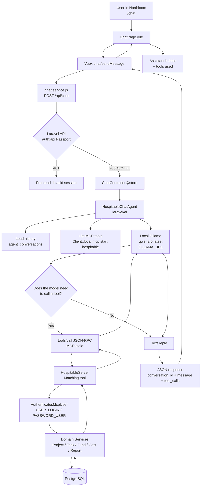
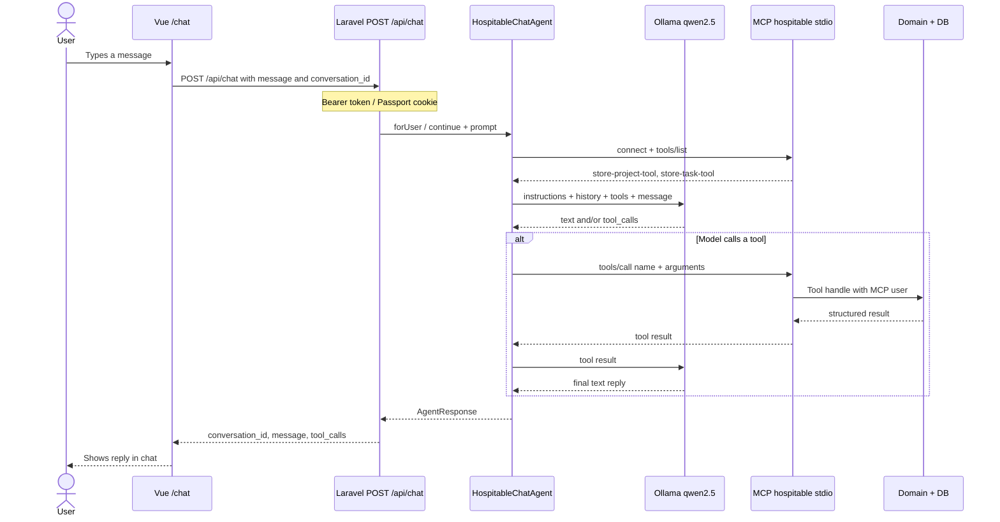

# Chatbot flow — Frontend → Ollama (Qwen 2.5) → Laravel MCP

Flow documentation for the Northloom planning assistant through to the Hospitable backend MCP tools.

## Overview

The user types in the Vue chat. The Laravel API authenticates the request, the agent (`HospitableChatAgent`) sends the message to **local Ollama (qwen2.5)**. The model decides whether it needs to call an MCP tool. If so, Laravel starts the local MCP server (`php artisan mcp:start hospitable`), runs the tool (create project, task, etc.), and returns the result to the model, which produces the final reply for the frontend.

## Detailed sequence

## Layers and files

| Step | Where | Role |
|---|---|---|
| UI | `src/modules/chat/pages/ChatPage.vue` | Chat, suggestions, bubbles, history |
| State | `src/modules/chat/store/chat.store.js` | Messages, `conversationId`, sending, conversations |
| HTTP | `src/modules/chat/services/chat.service.js` | `POST /chat`, `GET /conversations` |
| API route | `routes/api.php` → `ChatController` / `ConversationController` | Auth + orchestrates agent / history |
| Agent | `app/Ai/Agents/HospitableChatAgent.php` | Ollama provider + MCP tools |
| LLM config | `config/ai.php` + `.env` (`OLLAMA_URL`, `AI_MODEL`) | Ollama only |
| MCP registry | `routes/ai.php` → `Mcp::local('hospitable', …)` | stdio server |
| Tools | `app/Mcp/Tools/*` | Projects, tasks, funds, costs, etc. |

## Key points

1. **MCP ≠ chat.** MCP only exposes tools. Natural language is handled by **Ollama (qwen2.5)**.
2. **Two-layer auth**
   - Frontend → API: logged-in user (Passport).
   - MCP tools → domain: service account `USER_LOGIN` / `PASSWORD_USER`.
3. **Ollama on Windows / API in WSL-Docker**  
   `OLLAMA_URL` must point at the Windows host (e.g. `http://172.19.192.1:11434`), not the container `localhost`.
4. **Conversations** live in `agent_conversations` / `agent_conversation_messages` (`laravel/ai`). History is listed via `GET /conversations` and resumed via `conversation_id`.

## End-to-end example

1. User: *“Create an ERP project with currency BRL starting today.”*
2. Vue → `POST /api/chat`.
3. Agent sends the prompt + tool schemas to Qwen 2.5.
4. Qwen picks `store-project-tool` with `name`, `currency`, `starts_on`, `expected_ends_on`.
5. MCP runs the tool and persists the project.
6. Qwen replies in text confirming the created `id`.
7. Vue shows the reply and, if any, the tool used in the bubble.
